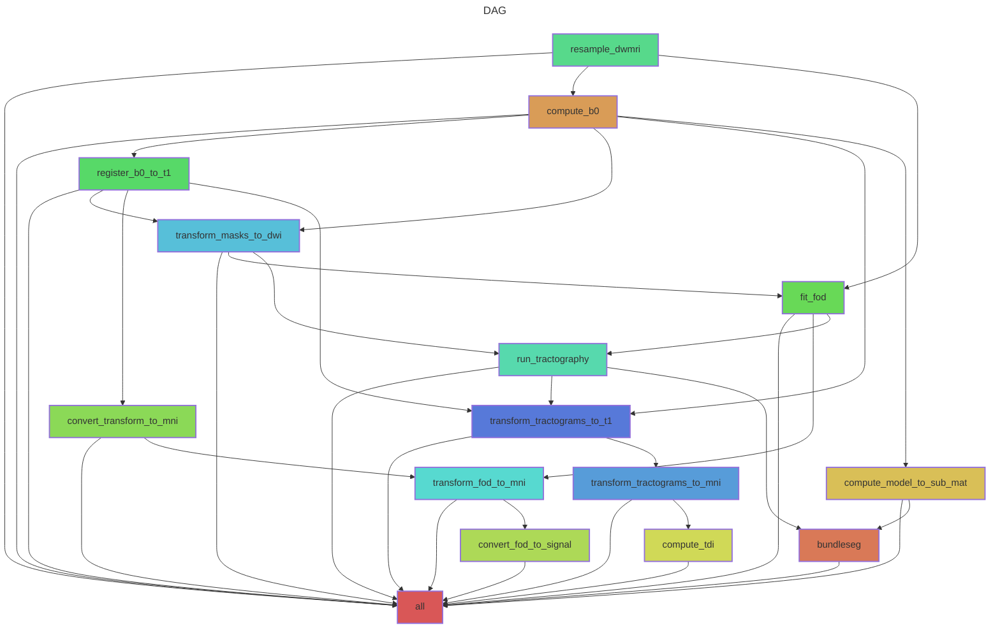

```mermaid
---
title: DAG
---
flowchart TB
	id0[all]
	id1[resample_dwmri]
	id2[compute_b0]
	id3[register_b0_to_t1]
	id4[transform_masks_to_dwi]
	id5[fit_fod]
	id6[convert_transform_to_mni]
	id7[transform_fod_to_mni]
	id8[convert_fod_to_signal]
	id9[run_tractography]
	id10[transform_tractograms_to_t1]
	id11[transform_tractograms_to_mni]
	id12[compute_tdi]
	id13[compute_model_to_sub_mat]
	id14[bundleseg]
	style id0 fill:#D95757,stroke-width:2px,color:#333333
	style id1 fill:#57D98B,stroke-width:2px,color:#333333
	style id2 fill:#D99C57,stroke-width:2px,color:#333333
	style id3 fill:#57D968,stroke-width:2px,color:#333333
	style id4 fill:#57BFD9,stroke-width:2px,color:#333333
	style id5 fill:#68D957,stroke-width:2px,color:#333333
	style id6 fill:#8BD957,stroke-width:2px,color:#333333
	style id7 fill:#57D9D0,stroke-width:2px,color:#333333
	style id8 fill:#ADD957,stroke-width:2px,color:#333333
	style id9 fill:#57D9AD,stroke-width:2px,color:#333333
	style id10 fill:#5779D9,stroke-width:2px,color:#333333
	style id11 fill:#579CD9,stroke-width:2px,color:#333333
	style id12 fill:#D0D957,stroke-width:2px,color:#333333
	style id13 fill:#D9BF57,stroke-width:2px,color:#333333
	style id14 fill:#D97957,stroke-width:2px,color:#333333
	id14 --> id0
	id7 --> id0
	id9 --> id0
	id13 --> id0
	id3 --> id0
	id6 --> id0
	id8 --> id0
	id12 --> id0
	id5 --> id0
	id4 --> id0
	id11 --> id0
	id1 --> id0
	id2 --> id0
	id10 --> id0
	id1 --> id2
	id2 --> id3
	id3 --> id4
	id2 --> id4
	id4 --> id5
	id1 --> id5
	id3 --> id6
	id6 --> id7
	id5 --> id7
	id7 --> id8
	id4 --> id9
	id5 --> id9
	id3 --> id10
	id9 --> id10
	id2 --> id10
	id10 --> id11
	id11 --> id12
	id2 --> id13
	id9 --> id14
	id13 --> id14
```
